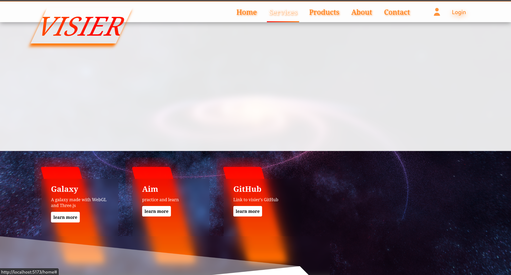

# BEST WISH 演示器

​**​寓意​**​：传递对世界的美好祝愿 ✨

演示:

## 技术实现

### 核心技术栈
- ​**​图形渲染​**​：基于 `WebGL`（与OpenGL同源，跨平台实现）
- ​**​开发框架​**​：通过 `three.js` 库简化以下操作：
  - `VertexShader` & `FragmentShader` 编写
  - 粒子系统与后期处理管线

### 核心效果实现
1. ​**​粒子流动算法​**​
   - 使用 `simplex-noise` 库生成 `Perlin Noise`
   - 将噪声映射到约束范围并添加动态抖动
   - 最终形成背景的​**​噪声长河流动效果​**​

2. ​**​丝滑处理​**​
   - 通过 three.js 的​**​后期处理管线​**​优化视觉效果

3. ​**​文字渲染​**​
   - 字体文件转JSON动态加载（本来作粒子文字约束的，水平有限，遂不作）

### 开发环境
- 采用​**​本地文件​**​引入依赖（规避CDN版本差异问题）

---

# HaHaHa 门户模板

> **说明**：这是一个应付任务的作业模板（是的，摆烂风格）。  
> 不过，别小看它 —— 模板中仍然融合了部分 `three.js` 技术与结构设计，**可复用性和设计感都在线**。

---

---

## ✨ 项目亮点

- 💡 使用 `three.js` 渲染背景，摆烂中透露一丝炫技
- 📐 响应式布局，适配不同分辨率设备（虽然只是调了几个百分比）
- 🧩 页面结构清晰，适合作为静态展示、活动页、个人介绍页模板
- 💬 文案逻辑分层，适合快速替换内容套用

---

## 🧱 技术栈

| 模块          | 简介                                 |
|---------------|--------------------------------------|
| `VUE.js` | 任务硬性要求，三剑客亦可完成               |
| `three.js`    | 实现背景动效及基础场景处理           |

---

## 📸 页面预览

